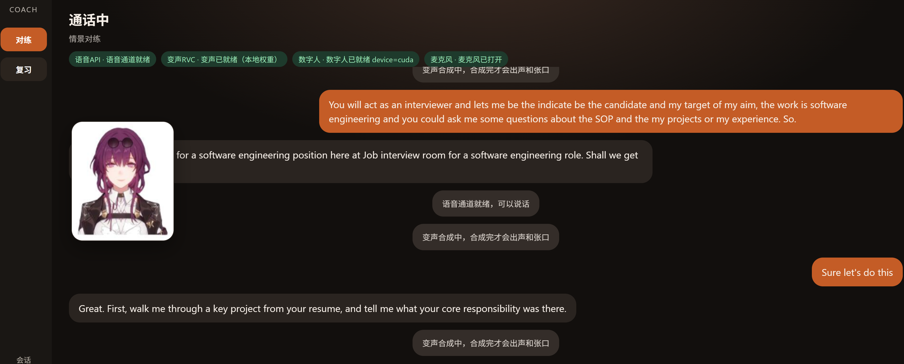

# EnglishCoach

端到端英语情景口语对练助手：麦克风全双工实时对话，主 Agent 只做角色扮演，不打断纠错；会话会落盘，不够地道的表达可事后生成练习题。

语音走火山引擎端到端全双工（[文档](https://docs.volcengine.com/docs/6561/2549778?lang=zh)）；文本模式、分析和出题走 OpenAI 兼容 Chat Completions。可选本地 RVC 变声，以及 THA3 口型数字人预览。网页端（`web/`）提供对练、复习和学习库。



## 功能

- **情景对练**：先描述场景，再进入角色扮演（`--scene` 可跳过收集）
- **全双工语音**：`python -m app.main --mode mic`
- **纯文本调试**：`python -m app.main --mode text`（不需要声卡）
- **会话记录**：`data/sessions/<session_id>.jsonl`
- **练习题生成**：从 jsonl 抽题，`python -m app.items <session_id>`；灌入本地学习库 `python -m app.library ingest <session_id>`
- **本地 HTTP API / 网页**：`python -m app.serve`（默认 `127.0.0.1:8765`）；前端 `web/`（Vue 3）
- **可选 RVC**：TTS 播放前做音色转换
- **可选 THA3 数字人**：`python -m app.main --mode mic --avatar`，或 `python -m app.avatar`

## 环境

Python 3.10+。基础依赖：

```bash
pip install -r requirements.txt
```

麦克风模式还需要可用的输入/输出设备（`sounddevice`）。

## 配置

```bash
cp config.toml.example config.toml
```

至少填写：

- `auth.api_key`：火山全双工实时语音 Key
- `llm.api_key`：OpenAI 兼容 Chat 的 Key

其余字段（音色、语速、RVC 参数、数字人路径等）已按当前可用默认值写在 example 里。`config.toml` 已被 gitignore，不要提交。

## 运行

在 `english_coach/` 目录下：

```bash
python -m app.main --mode text
python -m app.main --mode mic
python -m app.main --mode mic --scene "ordering coffee at a cafe"
python -m app.main --mode mic --avatar
python -m app.main --no-avatar

python -m app.items <session_id>
python -m app.library ingest <session_id>
python -m app.serve
python -m app.avatar

# 网页（另开终端）
cd web
npm install
npm run dev          # http://127.0.0.1:5173 ，/v1 代理到 8765
npm run build        # 产物 web/dist，可由 python -m app.serve 直接托管

```

退出：文本模式输入 `quit` / `exit` / `q`，或 Ctrl+C。

## 可选：复刻本地卡芙卡音色 / 数字人效果

RVC 和 THA3 **都不是强制依赖**。不装权重时，关闭 `[voice.rvc] enabled` / 使用 `--no-avatar` 即可正常对练。下面只给想接近本仓库作者本地效果的人一个指引。

### 卡芙卡 RVC（音色）

1. 安装推理依赖（与官方 WebUI 依赖分开，不要直接 `pip` 上游 `requirements.txt`）：

```bash
python -m pip install --isolated torch torchaudio --index-url https://download.pytorch.org/whl/cu128
python -m pip install -r requirements-rvc.txt
python -m scripts.setup_rvc
```

`setup_rvc` 会拉取 [RVC WebUI](https://github.com/RVC-Project/Retrieval-based-Voice-Conversion-WebUI) 源码到 `third_party/rvc/`，并下载 Hubert / RMVPE 到 `model_cache/rvc/`。

2. 自行下载说话人权重，放到默认路径（也可在 `config.toml` 的 `[voice.rvc]` 里改 `pth` / `index`）：

- `model_cache/KFK_V2_500.pth/KFK_V2_500.pth`
- `model_cache/KFK_V2_500.pth/added_IVF3491_Flat_nprobe_1_KFK_V2_500_v2.index`

本仓库作者使用的是社区公开的 **卡芙卡 RVC V2（500 轮）** 模型：

- 发布页：[崩坏：星穹铁道 - 卡芙卡RVC模型](https://www.ai-hobbyist.com/forum.php?mod=viewthread&tid=215&highlight=%E5%8D%A1%E8%8A%99%E5%8D%A1%2BRVC)（[AI Hobbyist](https://www.ai-hobbyist.com/)）
- 训练者：B 站「安妮熊的曲奇饼干」
- 数据集来源 / CV：徐慧
- 发布时要求：使用模型请标明出处

权重体积大，**不会**随本仓库分发。换成你自己的 `.pth` / `.index` 即可换音色。

### 卡芙卡立绘（数字人，示例可替换）

仓库里带了一张 THA3 用的示例立绘：`data/avatar/kafka_512.png`（崩坏：星穹铁道「卡芙卡」形象，仅作效果演示）。

替换方法：把任意符合 THA3 输入规格的 512×512 角色 PNG 放到同目录（或改 `avatar.character`），并自行准备 THA3 推理权重到 `model_cache/tha3/separable_float/`。权重来自 [Talking Head Anime 3](https://github.com/pkhungurn/talking-head-anime-3-demo)，同样不随仓库分发。

## 仓库里没有什么

以下内容只留在本机，不会进 GitHub：

| 类别 | 路径 |
| --- | --- |
| API Key | `config.toml` |
| 对练记录 / 练习题快照 | `data/sessions/*.jsonl`、`data/items/*.json` |
| 学习库 | `data/coach.sqlite`（题、测验、背记进度） |
| 模型权重 | `model_cache/`（RVC 说话人、Hubert、RMVPE、THA3 等） |
| RVC 上游仓库 | `third_party/rvc/` |
| 编辑器目录 | `.cursor/`、`.vscode/` |

参考实现原样放在 `ref_demo/`，业务代码不从那里 import。

## 出处与致谢

使用或复刻本项目时，请一并保留上游作者标注：

| 用途 | 项目 / 作者 | 说明 |
| --- | --- | --- |
| 全双工语音 | [火山引擎端到端实时语音](https://docs.volcengine.com/docs/6561/2549778?lang=zh) | 协议与官方 Python demo（见 `ref_demo/`） |
| 变声框架 | [RVC-Project / Retrieval-based-Voice-Conversion-WebUI](https://github.com/RVC-Project/Retrieval-based-Voice-Conversion-WebUI) | 本仓库只当推理库，不启动 Gradio WebUI |
| Hubert / RMVPE 权重 | [lj1995 / VoiceConversionWebUI](https://huggingface.co/lj1995/VoiceConversionWebUI) | `python -m scripts.setup_rvc` 下载 |
| 卡芙卡 RVC 模型 | [AI Hobbyist 发布帖](https://www.ai-hobbyist.com/forum.php?mod=viewthread&tid=215&highlight=%E5%8D%A1%E8%8A%99%E5%8D%A1%2BRVC)；训练者 B 站「安妮熊的曲奇饼干」；CV 徐慧 | 可选，不随仓库分发 |
| 数字人口型 | [Talking Head Anime 3](https://github.com/pkhungurn/talking-head-anime-3-demo)（Pramook Khungurn，MIT） | 源码在 `third_party/tha3/`，权重需自行放置 |
| 示例立绘 / 角色 | 崩坏：星穹铁道「卡芙卡」（米哈游）；CV 徐慧 | `data/avatar/kafka_512.png` 仅为可替换示例 |

角色、声线及相关美术/语音资产的权利归原权利方所有；本仓库只提供对练程序，以及一张可替换的效果示例图。
